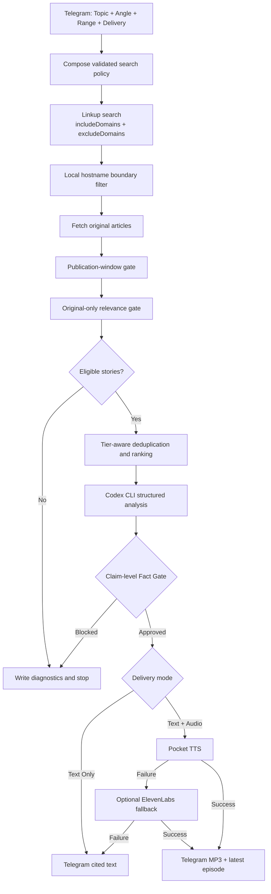

# AI Newsroom Studio

> A self-hosted newsroom that researches focused AI topics, checks every citation, and delivers text or spoken briefings through Telegram.

[](#quality-gates)
[](https://www.typescriptlang.org/)
[](https://t.me/Newsroomhermesbot)
[](https://github.com/openai/codex)

[Try the current Telegram bot](https://t.me/Newsroomhermesbot) · [Run locally](#quick-start) · [See the architecture](#architecture)

Choose an AI beat, the angle you care about, and how far back to look. AI Newsroom Studio researches it, checks the evidence, and returns a cited AI News Podcast or text briefing. Behind that simple flow are a policy-aware AI News Aggregator, Linkup Search, structured analysis through the local Codex CLI, a blocking Fact Gate, and Text-to-Speech delivery.

## Why AI Newsroom Studio?

General news search is noisy, and fluent summaries can hide weak evidence. This automated podcast generator narrows research before generation: each request applies a topic-based news search policy, accepts only fetched original articles inside the chosen publication window, and blocks unsupported claims before voice or publication. It is a practical way to follow AI agents news, Claude Code, OpenAI API changes, smart glasses and AI glasses, and other focused beats without treating search snippets as evidence.

## What it does

The English-only Telegram Bot guides one listener through four single-select choices, researches the selected beat, filters and ranks original sources, asks the official Codex CLI for structured analysis, verifies claim-level citations, and returns either a text briefing or an MP3 with clickable sources.

| Capability | Current behavior |
|---|---|
| Guided Telegram workflow | One topic, one analysis angle, one range, and one delivery mode per briefing |
| Policy-constrained discovery | Composes Topic + Angle JSON policies and sends native `includeDomains` / `excludeDomains` to Linkup |
| Local source boundary | Rechecks URL hostnames locally, accepting an exact configured domain or its subdomains only |
| Original-source relevance | Applies topic and angle terms to fetched original article content, never title/snippet matches alone |
| Publication safety | Enforces 24-hour, 3-day, or 7-day windows and rejects unknown, future, and out-of-window dates |
| Ranking and deduplication | Prefers tier 1 over tier 2, then uses policy matches, recency, and body quality while deduplicating |
| Fact-gated analysis | Requires verified story IDs and exact supporting excerpts for generated factual claims |
| Audio delivery | Uses local Pocket TTS first, with optional ElevenLabs fallback; failures degrade to cited text |
| Fail-closed operation | Zero eligible results stop before LLM analysis, TTS, episode writes, or Telegram publication |
| Diagnostics | Writes composed policies, rejection reports, candidates, evidence, analysis, Fact Gate, and audio outcomes to local artifacts |

## Telegram flow

The public bot is currently available at [@Newsroomhermesbot](https://t.me/Newsroomhermesbot); the handle retains its existing external name.

1. Press **Start**.
2. Choose one Topic: **AI Agents**, **AI Glasses**, **Claude Code**, **OpenAI API**, **AI x Blockchain**, or **AI Travel**.
3. Choose one Angle: **Startup Opportunities**, **Product Strategy**, **Technical Trends**, or **Investment Signals**.
4. Choose one range: **Past 24 Hours**, **Past 3 Days**, or **Past 7 Days**.
5. Choose **Text Only** or **Text + Audio**.
6. Review the confirmation and press **Generate Now**.
7. Receive a fact-gated briefing with source links in the same Telegram chat.

## Search policy

Each request composes a validated Topic profile with a validated analysis Angle. The Topic supplies beat keywords, tiered domains, exclusions, and a suggested range; the selected Telegram range always wins. The Angle adds required, preferred, and excluded terms.

### Topics and active sources

Only tiers 1 and 2 participate in search and ranking. Tier 3 is deliberately inactive.

| Topic | Active sources (tiers 1 + 2) |
|---|---:|
| AI Agents | 24 |
| AI Glasses | 26 |
| Claude Code | 23 |
| OpenAI API | 20 |
| AI x Blockchain | 24 |
| AI Travel | 22 |

Linkup receives the active domains through its native `includeDomains` field and topic exclusions through `excludeDomains`. A second, local hostname-boundary filter prevents suffix tricks and rejects results outside the composed allowlist. Relevance is evaluated only after fetching the original article: a Linkup title or snippet match cannot make an otherwise irrelevant article eligible.

Publication dates also fail closed. **Past 24 Hours**, **Past 3 Days**, and **Past 7 Days** become exact UTC boundaries; missing dates, invalid dates, future dates, and dates before the boundary are rejected. Eligible stories are deduplicated and ranked with source tier as a first-class signal.

If no story survives, the pipeline writes diagnostic reports and stops before Codex, Text-to-Speech, episode mutation, or Telegram publication.

## Architecture



The standalone RSS commands remain available for compatibility, while the interactive bot uses the policy-constrained Linkup → Codex → Fact Gate → voice path.

## Stack

- TypeScript, Node.js 22+, pnpm workspaces, Zod, and Vitest
- Next.js 14 for the landing page and latest episode player
- Linkup Search over direct HTTPS for discovery and original-source fetching
- Official OpenAI Codex CLI with subscription OAuth and `gpt-5.6-sol` for structured analysis
- Python, FastAPI, Kyutai Pocket TTS, ffmpeg, and optional ElevenLabs fallback
- Telegram Bot API for conversation state and delivery
- A retained Anthropic analysis adapter with injected contract tests; it is not the current bot runtime

## Quick start

### Prerequisites

- Node.js 22 or newer
- pnpm 10 or newer
- The official Codex CLI installed and authenticated with subscription OAuth (`codex login`)
- A Telegram bot token and Linkup API key
- Python 3.10–3.14, `uv`, and `ffmpeg` for local Pocket TTS

This project is designed and tested with Codex subscription OAuth: run `codex login` before starting the bot. Codex may support other authentication methods, but they are outside this project's verified setup; the application does not enforce a particular Codex authentication method at runtime. The bot launches Codex as an ephemeral, read-only subprocess, using `gpt-5.6-sol` by default.

```bash
git clone https://github.com/DAVIDshenghuei/ai-newsroom-studio.git
cd ai-newsroom-studio
pnpm install
cp .env.example .env
```

Configure `.env` without committing secrets. Runtime variable names are:

```dotenv
TELEGRAM_BOT_TOKEN=
TELEGRAM_CHAT_ID=
LINKUP_API_KEY=
CODEX_ANALYSIS_MODEL=
CODEX_CLI_ENTRYPOINT=
CODEX_ANALYSIS_TIMEOUT_MS=
POCKET_TTS_BASE_URL=
POCKET_TTS_API_KEY=
POCKET_TTS_SERVICE_API_KEY=
POCKET_TTS_VOICE=
POCKET_TTS_LANGUAGE=
POCKET_TTS_TIMEOUT_MS=
ELEVENLABS_API_KEY=
ELEVENLABS_VOICE_ID=
```

Normally, leave `CODEX_CLI_ENTRYPOINT` blank: the bot runs the official `codex` executable from `PATH`. Set it only when you need to launch a specific Codex JavaScript entrypoint through the current Node.js executable. Keep `CODEX_ANALYSIS_MODEL=gpt-5.6-sol` and `CODEX_ANALYSIS_TIMEOUT_MS=300000` unless you intentionally need different runtime settings.

When Pocket TTS authentication is enabled, `POCKET_TTS_API_KEY` and `POCKET_TTS_SERVICE_API_KEY` must contain the same shared secret: the bot sends the former and the local service validates it against the latter.

### Run locally

Start the web app:

```bash
pnpm --filter @ai-newsroom-studio/web dev
```

The landing page is at <http://localhost:3000> and the latest episode page is at <http://localhost:3000/episodes/latest>.

Start Pocket TTS in a second terminal:

```bash
pnpm pocket:service
```

Set `POCKET_TTS_BASE_URL=http://127.0.0.1:8001`, then start the bot in a third terminal:

```bash
pnpm newsroom:bot
```

Run only one long-polling process per Telegram token; concurrent `getUpdates` consumers cause Telegram `409` conflicts. Compatibility commands such as `newsroom:prepare`, `newsroom:voice`, and `newsroom:publish-telegram` intentionally keep their existing names.

## Add a Topic

Create the next ordered JSON file under `packages/newsroom/config/search-policies/topics/`. It must satisfy the strict Zod schema; this compact example shows the required shape:

```json
{
  "id": "example-beat",
  "topicLabel": "Example Beat",
  "menuLabel": "Example Beat",
  "sourceTiers": {
    "tier1": [{ "name": "Primary Source", "domain": "example.com" }],
    "tier2": [],
    "tier3": []
  },
  "activeSearchTiers": ["tier1", "tier2"],
  "excludedSources": [],
  "includeKeywords": ["Example AI"],
  "excludeKeywords": [],
  "suggestedTimeRange": "24h"
}
```

Then add the menu label to the bot's topic choices and update the search-policy contract fixture. Domains must be valid DNS hostnames and unique across tiers and exclusions.

## Quality gates

The verified TypeScript baseline is **161 tests passing**. Pocket TTS has a separate **5-test** Python suite.

```bash
pnpm test
pnpm typecheck
pnpm build
pnpm pocket:test
```

The TypeScript suite covers schemas, policy composition, native Linkup domain options, hostname boundaries, original-only relevance, publication windows, tier-aware ranking and deduplication, zero-result early exits, Codex analysis, Fact Gate behavior, TTS fallback, Telegram delivery, and web repositories. The Python suite exercises Pocket TTS HTTP validation, authentication, lazy engine reuse, safe errors, and MP3 conversion.

## Repository layout

```text
apps/web/                                      Next.js landing page and latest episode player
packages/newsroom/config/search-policies/     Topic and analysis policy JSON
packages/newsroom/src/                        Search, ranking, analysis, Fact Gate, voice, and bot
services/pocket-tts-service/                  Local FastAPI Pocket TTS service
config/feeds.json                              Standalone RSS/Atom feed configuration
artifacts/                                     Local diagnostic artifacts (gitignored)
apps/web/public/episodes/                      Generated latest episode metadata and audio
```

## Security

- Keep credentials only in the gitignored `.env`; never commit keys, tokens, generated private briefings, or Codex authentication state.
- Codex analysis runs ephemerally with a read-only sandbox and receives fetched news as untrusted input.
- Search and analysis failures fail closed, and generated factual claims cannot pass without verified original-source excerpts.
- Diagnostic artifacts contain research content and should be treated as local data even though secrets are excluded.
- Rotate any credential exposed in logs, screenshots, chat, or issue reports.
