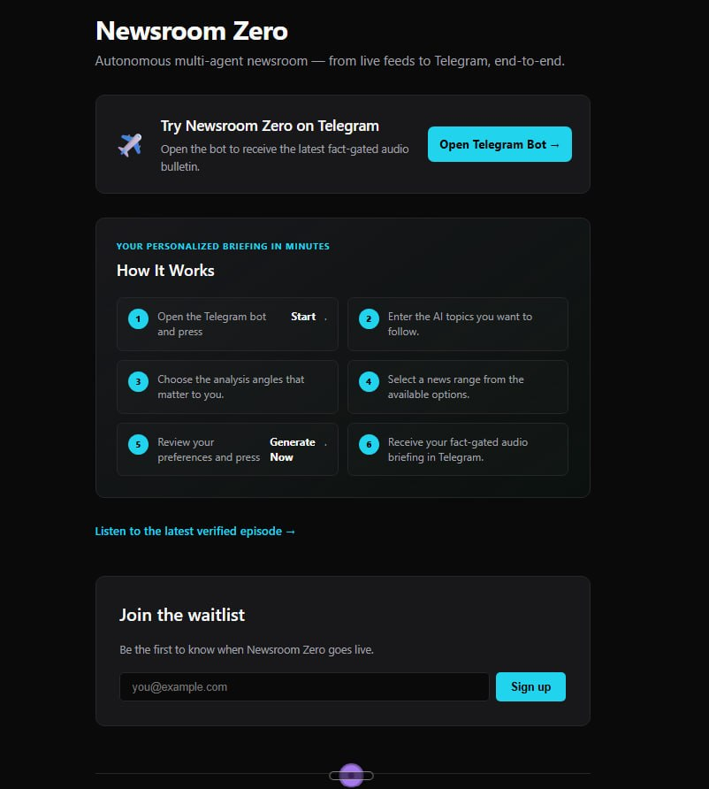
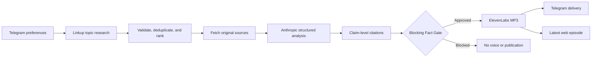

# Newsroom Zero

> An autonomous, fact-gated audio newsroom that turns personalized interests into cited Telegram briefings.

[](#quality-gates)
[](https://www.typescriptlang.org/)
[](https://t.me/Newsroomhermesbot)

Built for the **Hermes Buildathon**.

[Open the Telegram Bot](https://t.me/Newsroomhermesbot) · [Jump to the demo flow](#telegram-demo-flow)



## What It Does

Newsroom Zero collects a listener's preferred topics, analysis angle, and news range through an English-only Telegram conversation. It researches current stories with Linkup, validates and ranks the results, verifies original sources, applies a blocking Fact Gate, synthesizes the approved script with ElevenLabs, and delivers the resulting MP3 with citations back to the same Telegram chat.

## Telegram Demo Flow

1. Open [@Newsroomhermesbot](https://t.me/Newsroomhermesbot) and press **Start**.
2. Enter the AI topics you want to follow.
3. Choose the analysis angles that matter to you.
4. Select a news range: **Past 24 Hours**, **Past 3 Days**, or **Past 7 Days**.
5. Review your preferences and press **Generate Now**.
6. Receive a fact-gated audio briefing with clickable sources in Telegram.

All Telegram Bot copy and interactions are in English.

## Pipeline



### Safety Properties

- Every factual script segment carries a story ID and canonical source URL.
- Original article content must be fetched and verified before approval.
- Every LLM-generated factual claim must cite one or more verified story IDs.
- Every claim must include exact supporting excerpts that are found in the cited verified originals.
- Anthropic system instructions are separated from user preferences and source documents, which are treated as untrusted data.
- Unknown story IDs, malformed JSON, missing citations, and provider failures fail closed.
- Unsupported or mismatched citations block the edition.
- Voice generation and publication happen only after Fact Gate approval.
- Linkup retries only transient network and `5xx` failures; invalid responses and persistent failures remain blocked.
- API keys are read from `.env` and are never committed.

## Current Capabilities

- Interactive, per-chat Telegram onboarding and persisted workflow state
- Linkup search and original-source fetch
- Topic-aware story validation, deduplication, and ranking
- Anthropic structured summaries, cross-story trends, strategic implications, and recommendations
- Claim-level citation and research-aware blocking Fact Gate
- ElevenLabs text-to-speech generation
- Personalized Telegram MP3 delivery with sources
- Local Next.js landing page and latest episode player
- Live RSS/Atom ingestion for the standalone newsroom pipeline

The interactive Bot uses grounded Anthropic analysis. The standalone RSS preparation commands retain their deterministic script path for backward compatibility.

## Local Setup

### Requirements

- Node.js `22+`
- pnpm `10+`
- A Telegram bot token
- A Linkup API key
- An Anthropic API key
- An ElevenLabs API key

### Install

```bash
git clone https://github.com/DAVIDshenghuei/Newsroom-Zero.git
cd Newsroom-Zero
pnpm install
cp .env.example .env
```

Add your credentials to `.env`:

```dotenv
TELEGRAM_BOT_TOKEN=
TELEGRAM_CHAT_ID=
LINKUP_API_KEY=
ANTHROPIC_API_KEY=
ANTHROPIC_MODEL=claude-sonnet-4-5-20250929
ELEVENLABS_API_KEY=
```

Never commit `.env` or paste production credentials into issues or screenshots.

## Run the Demo Locally

Start the landing page:

```bash
pnpm --filter @newsroom-zero/web dev
```

Open:

- Landing page: <http://localhost:3000>
- Latest episode: <http://localhost:3000/episodes/latest>

In a second terminal, start the long-polling Telegram Bot:

```bash
pnpm newsroom:bot
```

Only one Bot polling process should run at a time. Multiple `getUpdates` processes for the same token cause Telegram HTTP `409` conflicts.

## Standalone Pipeline Commands

```bash
pnpm newsroom:prepare
pnpm newsroom:voice
pnpm newsroom:publish-telegram
```

The interactive `pnpm newsroom:bot` command runs the personalized research, verification, voice, and delivery path after the user presses **Generate Now**.

## Quality Gates

```bash
pnpm test
pnpm typecheck
pnpm build
```

Current verified baseline:

- **81 tests passing**
- TypeScript typecheck passing
- Next.js production build passing
- Real Linkup → Fact Gate → ElevenLabs → Telegram deterministic flow exercised successfully
- Anthropic integration is covered by injected HTTP contract tests; a valid `ANTHROPIC_API_KEY` is required for live LLM verification

## Repository Layout

```text
apps/web/                  Next.js landing page and episode player
packages/newsroom/src/     Research, ranking, Fact Gate, voice, and Telegram workflow
apps/web/public/episodes/  Latest generated episode metadata and MP3
docs/assets/               README and demo images
artifacts/                 Local generated workflow artifacts (gitignored)
```

## Tech Stack

- TypeScript
- Node.js
- pnpm workspaces
- Next.js 14
- Zod
- Vitest
- Linkup API
- Anthropic Messages API
- ElevenLabs API
- Telegram Bot API

## Security

Secrets belong only in `.env`. The repository ignores runtime credentials and local generated artifacts. If a credential is ever exposed in chat, logs, or screenshots, rotate it before production use.
