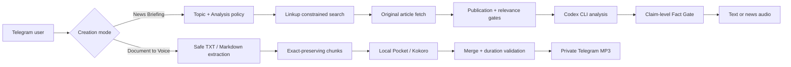

# AI Newsroom Studio

> Important reading, ready to listen.

**Trusted news and your own documents, turned into portable audio.**

[](https://www.typescriptlang.org/)
[](https://t.me/Newsroomhermesbot)
[](https://github.com/openai/codex)

[Open the Telegram bot](https://t.me/Newsroomhermesbot) · [Listen to the latest episode](https://ai-newsroom-studio.vercel.app/episodes/latest) · [Run locally](#quick-start)

AI Newsroom Studio is a private listening studio with two distinct creation modes:

1. **News Briefing** researches a chosen AI beat, analyzes fetched original articles, checks claims against cited evidence, and returns text or audio.
2. **Document to Voice** reads a user-provided TXT or Markdown file verbatim through local speech generation, without research, rewriting, or translation.

The modes share a Telegram entry point and audio infrastructure, but their source handling stays separate. Document prose never enters Linkup, Codex analysis, the Fact Gate, news publication, or the latest-episode files.

## Current experience

### Create a News Briefing

The English-only Telegram interface asks for one topic, analysis angle, publication range, output language, and delivery mode. AI Newsroom Studio then:

1. Composes validated Topic + Analysis search policies.
2. Applies Linkup domain restrictions and a local hostname-boundary check.
3. Fetches original articles and rejects missing, invalid, future, or out-of-window publication dates.
4. Ranks eligible tier 1 and tier 2 sources and removes duplicates.
5. Runs structured Codex CLI analysis in the selected output language.
6. Blocks unsupported factual claims at the claim-level Fact Gate.
7. Delivers cited text or audio through Telegram.

News briefings support English, French, German, Spanish, Italian, Portuguese, and Traditional Chinese output. Six languages route to Pocket TTS and Traditional Chinese routes to Kokoro-82M. ElevenLabs remains an optional fallback for the news path; if all audio providers fail, delivery degrades safely to cited text.

### Turn a Document into Audio

Release A is intentionally narrow:

- Transport: Telegram
- Accepted files: TXT and Markdown only, up to 5 MB and 10,000 extracted characters
- Voice languages: English and Traditional Chinese only
- English voice: local Pocket TTS with `alba`
- Traditional Chinese voice: local Kokoro-82M with `zf_xiaoxiao`
- Text behavior: verbatim order and wording; no rewrite and no translation
- External speech fallback: off
- Retention: cleanup runs at 24 hours while the bot is online; overdue jobs are removed on the next startup scan
- Concurrency: one active conversion per Telegram user
- Output: duration-validated MP3 delivered to the same Telegram chat

Telegram is a cloud transport. The bot downloads the accepted file for processing by the configured local service, so this mode is described as local processing rather than a device-only privacy guarantee. Confirmation copy shows the route before generation.

## Processing contract

Document confirmations expose these boundaries:

```text
Transport: Telegram
Processing: Local
External fallback: Off
Translation: Off
Retention target: 24 hours · Cleanup: startup and every 60 seconds while the local bot is online.
```

The bot runs cleanup independently from polling and speech generation. If the bot is offline at expiry, deletion is eventually consistent and occurs during the next startup scan.

Analytics events contain safe operational properties such as file type, size bucket, character bucket, language, provider, duration, processing time, and error code. They do not contain the source filename or extracted prose.

## Architecture



The framework-neutral `@ai-newsroom-studio/newsroom` package owns contracts, policy composition, search and fetch clients, ranking, analysis adapters, the Fact Gate, speech routing, document jobs, and Telegram workflows. The Next.js app owns the editorial landing page, waitlist endpoint, and latest episode player. The local FastAPI service is the single process that loads Pocket or Kokoro speech models.

Document jobs live under isolated, gitignored artifacts. They never write or publish `apps/web/public/episodes/latest.json` or `latest.mp3`.

## News search policy

Each news request composes a validated Topic profile with a validated analysis Angle. The Topic supplies beat keywords, tiered domains, exclusions, and a suggested range; the Telegram range always wins. The Angle adds required, preferred, and excluded terms.

Only tiers 1 and 2 participate in search and ranking. Tier 3 remains discovery-only. Linkup receives active domains through native restrictions, then a local hostname filter accepts only an exact configured domain or its subdomains. Final relevance uses fetched original content rather than provider titles or snippets.

Past 24 Hours, Past 3 Days, and Past 7 Days become exact UTC boundaries. Unknown, malformed, future, and early dates fail closed. If no story survives, the pipeline stops before Codex, speech generation, publication, or episode writes.

## Speech routing

| Output | Local engine | Language/model | Primary voice |
|---|---|---|---|
| English | Pocket TTS | `english` | `alba` |
| French | Pocket TTS | `french_24l` preview | `estelle` |
| German | Pocket TTS | `german_24l` preview | `juergen` |
| Spanish | Pocket TTS | `spanish_24l` preview | `lola` |
| Italian | Pocket TTS | `italian` | `giovanni` |
| Portuguese | Pocket TTS | `portuguese` | `rafael` |
| Traditional Chinese | Kokoro-82M | `chinese_traditional` / `lang_code=z` | `zf_xiaoxiao` |

The seven-language table describes news output. Release A document delivery uses only English and Traditional Chinese, with external fallback disabled.

## Stack

- TypeScript, Node.js 22+, pnpm workspaces, Zod, and Vitest
- Next.js 14 for the landing page and latest episode player
- Linkup Search for constrained news discovery and original-source fetching
- Official OpenAI Codex CLI with subscription OAuth and `gpt-5.6-sol` for news analysis
- Python, FastAPI, Kyutai Pocket TTS, Kokoro-82M, ffmpeg, and ffprobe
- Optional ElevenLabs fallback for news audio only
- Telegram Bot API for conversation state, file transport, and delivery

## Quick start

### Prerequisites

- Node.js 22 or newer
- pnpm 10 or newer
- Official Codex CLI authenticated with subscription OAuth (`codex login`)
- Telegram bot token and Linkup API key
- Python 3.10–3.14, `uv`, ffmpeg, and ffprobe for local speech generation

```bash
git clone https://github.com/DAVIDshenghuei/ai-newsroom-studio.git
cd ai-newsroom-studio
pnpm install
cp .env.example .env
```

Configure `.env` without committing secrets:

```dotenv
TELEGRAM_BOT_TOKEN=
TELEGRAM_CHAT_ID=
LINKUP_API_KEY=
CODEX_ANALYSIS_MODEL=
CODEX_CLI_ENTRYPOINT=
CODEX_ANALYSIS_TIMEOUT_MS=
POCKET_TTS_BASE_URL=
POCKET_TTS_API_KEY=
POCKET_TTS_SERVICE_API_KEY=
POCKET_TTS_VOICE=
POCKET_TTS_LANGUAGE=
POCKET_TTS_TIMEOUT_MS=
ELEVENLABS_API_KEY=
ELEVENLABS_VOICE_ID=
```

Normally leave `CODEX_CLI_ENTRYPOINT` blank so the bot runs `codex` from `PATH`. The current verified analysis default is `CODEX_ANALYSIS_MODEL=gpt-5.6-sol`. When Pocket authentication is enabled, `POCKET_TTS_API_KEY` and `POCKET_TTS_SERVICE_API_KEY` must contain the same shared secret.

### Run locally

Start the web app:

```bash
pnpm --filter @ai-newsroom-studio/web dev
```

The landing page is at <http://localhost:3000>; the latest episode player remains at <http://localhost:3000/episodes/latest>.

Start the local speech service in a second terminal:

```bash
pnpm pocket:service
```

Set `POCKET_TTS_BASE_URL=http://127.0.0.1:8001`, then start the bot in a third terminal:

```bash
pnpm newsroom:bot
```

Keep only one long-polling process active per Telegram token. Concurrent `getUpdates` consumers cause Telegram `409` conflicts. Compatibility commands such as `newsroom:prepare`, `newsroom:voice`, and `newsroom:publish-telegram` retain their existing names.

## Commands and quality gates

```bash
pnpm test
pnpm typecheck
pnpm build
pnpm pocket:test
```

The verified TypeScript baseline is **235 tests passing**. The local Pocket/Kokoro service has a separate **9-test** Python suite.

The TypeScript suite covers schemas, policy composition, domain restrictions, hostname boundaries, original-only relevance, publication windows, ranking, zero-result exits, Codex analysis, the Fact Gate, speech routing, fallback behavior, Telegram delivery, document extraction and chunking, privacy-safe events, audio validation, protected episode artifacts, brand claims, and web repositories. The Python suite covers HTTP validation, authentication, lazy engine reuse, Kokoro chunk concatenation, safe errors, and MP3 conversion.

## Repository layout

```text
apps/web/                                      Next.js landing page and latest episode player
packages/newsroom/config/search-policies/     Topic and analysis policy JSON
packages/newsroom/src/                        News and document listening workflows
services/pocket-tts-service/                  Local FastAPI Pocket/Kokoro TTS service
config/feeds.json                              Standalone RSS/Atom feed configuration
artifacts/                                     Local jobs and diagnostics (gitignored)
apps/web/public/episodes/                      Protected latest news episode artifacts
```

## Security

- Keep credentials in the gitignored `.env`; never commit keys, tokens, document jobs, generated diagnostics, or Codex authentication state.
- Telegram transports document uploads to the bot. Local processing and 24-hour retention do not change that transport boundary.
- Document prose never goes to Linkup, Codex, the Fact Gate, ElevenLabs, or news publication.
- Codex analysis runs only on the news path, in a read-only sandbox, with fetched articles treated as untrusted input.
- Search and analysis fail closed; generated factual claims require verified original-source excerpts.
- Filenames are sanitized, job paths are server-owned, and completed document audio must pass MP3 and duration validation.
- Rotate any credential exposed in logs, screenshots, chat, or issue reports.

## Project history

AI Newsroom Studio began as a focused, policy-constrained AI newsroom. That trusted-news path remains intact. Release A adds the Telegram Document to Voice tracer bullet under the broader promise of important reading made listenable, while keeping the product name and technical repository structure unchanged.
